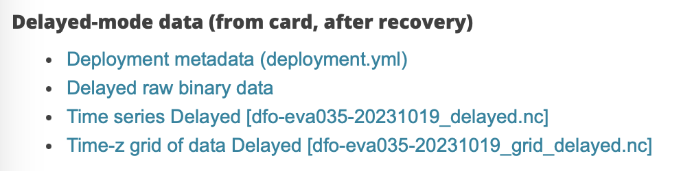

CL and DK met over zoom.

# Purpose
Find URLs for sample glider files (for oce glider pkg).

# Notes

## Sea-explorer

See https://cproof.uvic.ca/gliderdata/deployments/dfo-eva035/dfo-eva035-20231019/

### delayed-mode individual files

* link 2 in Fig 1: directory with sub and pld files, one per yo
* link 3 in Fig 1: huge nc file with all the data (I guess)

I think link 2 is echoed at the ioos link
https://gliders.ioos.us/erddap/files/dfo-eva035-20190613T1750-delayed/

## Slocum

FIXME: try looking at cproof and ioos, similar to above.

## Other

I guess there are other glider types, but I'm drawing a blank
at the moment...

